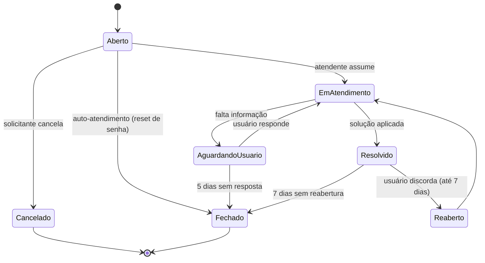
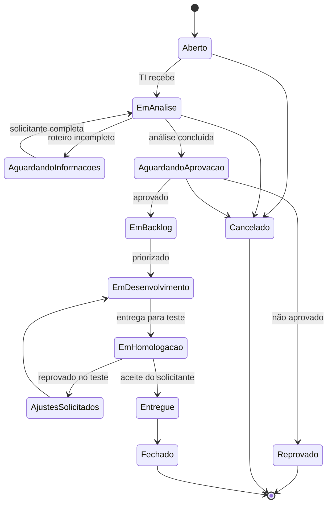

# Arquitetura — Gestão de Chamados (Service Desk) | AirPort Now

Módulo de abertura, atendimento e acompanhamento de chamados do AirPort Now.
Estende o que já existe (`tbl_ServiceDesk` + `ScreenServiceDeskForm`) para dois
ciclos de vida distintos, recorte por usuário logado e acompanhamento guiado de
demandas de produto.

Documentos irmãos:

- [ESTRUTURA_LISTAS_CHAMADOS.md](ESTRUTURA_LISTAS_CHAMADOS.md) — colunas, tipos e
  ordem de criação no SharePoint.
- [ROTEIRO_NOVO_MODULO.md](ROTEIRO_NOVO_MODULO.md) — o roteiro guiado de
  "Solicitação de novo módulo" e as sete etapas de acompanhamento.

---

## 1. Decisões estruturais

| # | Decisão | Por quê |
|---|---------|---------|
| 1 | **Dois ciclos de vida**, não um | Um chamado de senha morre em minutos; uma demanda de módulo vive meses. Forçar os dois no mesmo conjunto de status produz relatório mentiroso e tela confusa. |
| 2 | **Fila única do time de TI** | Sem triador e sem grupo por categoria. Qualquer atendente assume qualquer chamado. Menos coluna, menos tela, menos processo parado esperando alguém direcionar. |
| 3 | **Identidade = lista `User`** (login próprio do app) | O AirPort Now não usa AAD para autenticar. O recorte "meus chamados" sai do registro logado, não de `User().Email`. |
| 4 | **Coluna-espelho de e-mail em Texto** | `desk_usuario` é campo Pessoa e `Filter(tbl, desk_usuario.Email = X)` **não é delegável** no SharePoint. O recorte roda sobre `desk_solicitante_email` (Texto). |
| 5 | **Catálogo de categorias em `App.Formulas`**, não em lista | Dado estático, lido em toda abertura de chamado. Named formula = zero consulta. Consequência obrigatória: `desk_categoria` vira coluna **Texto**, não Escolha. |
| 6 | **Histórico em lista separada e imutável** | O ciclo de vida completo exige saber *quando* e *por quem* cada transição aconteceu. Versionamento do SharePoint não é consultável pelo app. |
| 7 | **Campos da demanda numa lista-extensão 1-para-1** | As ~15 perguntas do roteiro de novo módulo só existem para 4 das 10 categorias. Não poluem a lista mestre nem o formulário de suporte. |

### Limite conhecido

O recorte por usuário depende de `desk_solicitante_email` estar preenchido. Os
chamados **já existentes** não têm essa coluna: precisam de uma carga única
copiando `desk_usuario.Email` para o espelho antes de a tela de Meus Chamados
entrar em produção. Sem isso o usuário abre a tela e não vê o próprio histórico.

---

## 2. Critério: dado local ou lista SharePoint?

Mesma régua já adotada em Frotas.

### Vai para `App.Formulas` (named formula)

- Catálogo de categorias/temas: nome, ciclo, SLA, ícone, se exige roteiro.
- Conjuntos de status de cada ciclo e suas transições permitidas.
- Cores e rótulos de status e prioridade.
- Matriz de SLA por prioridade.

Muda por decisão de TI, não por operação. Vira uma linha de código e um deploy —
não uma lista que alguém edita sem avisar e derruba o `If` da tela.

### Vira lista SharePoint

- O chamado (mestre).
- O histórico de transições.
- As interações (conversa solicitante ↔ atendente).
- Os campos da demanda de módulo.

Tudo que cresce por operação, tem anexo, ou precisa de trilha de auditoria.

### Consequência: enumeração local exige coluna Texto

Se a lista de categorias vive em `App.Formulas`, a coluna **não pode ser Escolha**
— o SharePoint rejeitaria qualquer valor fora do próprio conjunto dele, e passaria
a existir duas fontes da verdade que divergem em silêncio. `desk_categoria`,
`desk_status` e `desk_prioridade` são todas **Texto**.

> **Migração:** hoje `desk_categoria` é Escolha e a tela usa
> `Choices([@tbl_ServiceDesk].desk_categoria)`. Ver seção 6.

---

## 3. Modelo de dados

### 3.1 A mestre e seus satélites

```
tbl_ServiceDesk  (mestre — um registro por chamado)
├── tb_chamadoHistorico     N:1  toda transição de status (imutável)
├── tb_chamadoInteracao     N:1  mensagens entre solicitante e atendente
└── tbl_ChamadoDemanda       1:1  respostas do roteiro (só ciclo B)
```

### 3.2 Padrão obrigatório de toda lista-filha

1. Coluna `id_fk_chamado` (Número) como chave estrangeira — **nunca** campo Pesquisa.
   Pesquisa no SharePoint limita filtro, quebra delegação e trava a exclusão do pai.
2. Nome no padrão `tb_` + camelCase e chave estrangeira `id_fk_<entidade>`; `Título` desobrigado e removida de todas as views.
3. Índice na chave estrangeira, criado **antes** de a lista passar de 5.000 itens.
4. Nenhuma coluna Sim/Não — usar Texto com literais explícitos.

### 3.3 Chave do chamado — `desk_id`

Continua sendo o número sequencial calculado no app (`último + 1`), formatado
como `#000123` na interface. A revisão de 2026-08-27 já fechou a duplicação
dentro da mesma sessão e passou a revalidar no clique de confirmar.

**A corrida entre usuários simultâneos permanece em aberto.** Duas saídas, nesta
ordem de preferência:

1. Adotar a coluna `ID` nativa do SharePoint como protocolo e aposentar `desk_id`.
   Elimina a corrida de vez; custo: o número só existe depois de gravar.
2. Manter `desk_id` e aceitar a colisão rara, tratando-a no atendimento.

### 3.4 Campos-espelho

| Espelho | Origem | Serve para |
|---|---|---|
| `desk_solicitante_email` | `desk_usuario.Email` | recorte delegável de "meus chamados" |
| `desk_ciclo` | categoria → `App.Formulas` | separar os dois ciclos sem `If` espalhado |

**Espelho só existe quando resolve delegação.** Nome de exibição do solicitante
não vira coluna: a coleção já traz `desk_usuario.DisplayName` junto com a linha,
e ler dela não custa consulta nenhuma. Data de abertura não vira coluna: `Created`
é nativa, delegável e preenchida sozinha.

Espelho é gravado **no mesmo `Patch`/`SubmitForm` do dado de origem**, nunca por
fluxo posterior. Um espelho que depende de fluxo é um espelho que passa metade
do tempo desatualizado.

---

## 4. Ciclo de vida

### 4.1 Ciclo A — Suporte

Categorias: reset de senha, acesso e permissão, erro no sistema, dúvida de uso,
correção de dado, desempenho.



O reset de senha é o único caminho que nasce e morre na mesma transação: a tela
grava `Resolvido`, aplica a senha e envia o e-mail. Não passa pela fila.

### 4.2 Ciclo B — Demanda de produto

Categorias: novo módulo, melhoria em módulo existente, novo relatório/indicador,
integração com outro sistema.



Cancelamento pelo solicitante só até `Aguardando aprovação`. Depois que entra em
backlog, cancelar é decisão de TI — senão o esforço de análise já gasto some sem
registro.

### 4.3 Onde os status são declarados

Nenhum status é digitado na tela. Todos vêm de `App.Formulas`, com as transições
permitidas por status — o botão de ação da tela de detalhe é gerado a partir
dessa tabela, não de um `If` encadeado.

---

## 5. Regras de performance e delegação

| Consulta | Delegável? | Como fica |
|---|---|---|
| Meus chamados | ✅ | `Filter(tbl_ServiceDesk; desk_solicitante_email = varUsuarioLogado.usrEmail)` — Texto = Texto |
| Meus chamados abertos | ✅ | acrescenta `And desk_status <> "Fechado"` |
| Fila de TI | ✅ | `Filter(tbl_ServiceDesk; desk_status in [...])` → escrever como cadeia de `Or`, `in` sobre coluna **não** delega |
| Chamado por número | ✅ | `LookUp(tbl_ServiceDesk; desk_id = varNum)` |
| Histórico de um chamado | ✅ | `Filter(tb_chamadoHistorico; id_fk_chamado = varNum)` |
| Contagem por status no painel | ❌ | `CountRows` sobre `Filter` delegado é seguro até 2.000; acima disso, coleção agregada uma vez |

Regras que valem sempre:

- **Nunca** `Filter` sobre campo Pessoa expandido (`desk_usuario.Email`). É o
  motivo de existir o espelho.
- **Nunca** `LookUp`/`Filter` dentro da propriedade `Fill`, `Text` ou `Visible` de
  item de galeria: é uma consulta por linha a cada render. Calcular antes, numa
  coleção, e a galeria lê com `LookUp(colX; ...)` sobre a coleção local.
- Ordenação da lista do usuário por `desk_id` decrescente — coluna numérica
  indexada, delegável.
- `Search()` sobre a descrição **não** delega no SharePoint. A busca textual roda
  sobre a coleção já recortada do usuário, não sobre a lista inteira.

---

## 6. Migração do que já existe

Ordem obrigatória. Cada passo é reversível sozinho.

1. **Criar as colunas novas** em `tbl_ServiceDesk` (ver ESTRUTURA_LISTAS).
   Nenhuma obrigatória nesta etapa — a tela atual continua gravando sem elas.
2. **Carga única do espelho** nos chamados existentes: copiar
   `desk_usuario.Email` → `desk_solicitante_email`. Sem isso o histórico do
   usuário nasce vazio.
3. **Preencher `desk_status`** dos registros antigos que estiverem em branco com
   `"Fechado"` — nulo não é status, e nulo ≠ `"Fechado"` em qualquer `Filter`.
4. **Publicar `App.Formulas`** com o catálogo de categorias e status.
5. **`desk_categoria`: Escolha → Texto.** O SharePoint converte preservando os
   valores. Depois disso, na `ScreenServiceDeskForm`:
   - `DataCardValue10_2.Items`: `Choices([@tbl_ServiceDesk].desk_categoria)` →
     `nfCategorias`
   - `DataCardValue10_2.DisplayFields`/`SearchFields`: `["Value"]` → `["Nome"]`
   - `desk_categoria_DataCard2_2.Update`: `.Selected` → `.Selected.Nome`
   - as duas comparações `= "Reset da Senha"` passam a ler
     `.Selected.Chave = "RESET_SENHA"` — literal estável, imune a mudança de rótulo
     (checklist item 21 das lições).
6. **Passar a gravar os espelhos** no `SubmitForm` da tela de abertura.
7. Só então **publicar a tela de Meus Chamados**.

---

## 7. Camada de aplicação

### 7.1 Convenções

- Telas: `Screen<Assunto>` — `ScreenMeusChamados`, `ScreenChamadoDetalhe`.
- Variáveis globais: `var<Assunto>`; de contexto: `varDesk<Assunto>`.
- Coleções: `col<Assunto>`.
- Named formulas: `nf<Assunto>`.
- Nada de `Título` do SharePoint em lugar nenhum.

### 7.2 Contexto do usuário

Contrato confirmado contra a tela de Login. Ao autenticar, ela grava:

| Variável global | Origem em `User` | Uso neste módulo |
|---|---|---|
| `userRecord` | registro inteiro | fallback |
| `varIdUser` | `ID` | — |
| `varNomeUser` | `usrNome` | nome exibido |
| **`varEmailUser`** | **`Email`** | **recorte "meus chamados"** |
| `varPerfilUser` | `Perfil` | recorte da fila por escopo (onda 4) |
| `varAutUser` | `Autorizacao` | — (não usado neste módulo) |
| `varFuncaoUser` | `Funcao` | — |
| `varAeroUser` / `varIATAUser` / `varICAOUser` | `Aeroporto` + `colAeros` | recorte por aeroporto (onda 4) |
| `Logado` | — | `true` após autenticar |

Colunas conhecidas de `User`: `ID`, `Usuarios` (login), `Senha`, `Validacao`,
`usrNome`, `Email`, `Funcao`, `Bloco`, `Aeroporto`, `Perfil`, `Autorizacao`,
`View_safety`.

Nenhuma tela deste módulo consulta `User` por conta própria — todas leem das
variáveis acima.

**Nenhuma coluna compartilhada é reaproveitada como papel.** `Autorizacao`
(AdmAVSEC / Admin / Usuário) e `Perfil` (Base / Bloco / Sede) governam o app
inteiro: pendurar o papel do service desk nelas faria com que mexer em quem é
`Admin` por causa de outro módulo mudasse, em silêncio, quem aprova demanda aqui.

O papel sai de uma **coluna própria** em `User`:

| `usr_papel_chamados` | Papel | Pode |
|---|---|---|
| `GESTOR` | Gestor | tudo: assumir, resolver, aprovar e reprovar demanda |
| `ATENDENTE` | Atendente | assumir, transitar status, responder, resolver |
| *(em branco ou qualquer outro valor)* | Solicitante | abrir, acompanhar, responder, cancelar, reabrir, dar aceite |

Propriedades desta escolha:

- **Aditiva.** Nenhum outro módulo lê a coluna. Criar não quebra nada; deixar em
  branco mantém todo mundo como solicitante, que é o padrão seguro.
- **Nenhuma alteração na tela de Login.** O `Login` já guarda o registro inteiro
  em `userRecord`, então a tela de detalhe lê `userRecord.usr_papel_chamados` sem
  consulta extra e sem tocar em fluxo de autenticação.
- **Um único ponto de leitura** — o `Switch` do `OnVisible` de
  `ScreenChamadoDetalhe`. Nenhuma outra tela decide papel.

`Perfil` continua reservado para o recorte da fila na onda 4 (atendente de Base
não precisa ver a fila da Sede) — e, se ali também atrapalhar, ganha coluna
própria pelo mesmo critério.

### Correção pendente na tela de abertura

`ScreenServiceDeskForm` casa o solicitante por `LookUp(User; usrNome = <DisplayName do campo Pessoa>)`.
Nome de exibição do AAD e `usrNome` da lista são duas grafias diferentes da mesma
pessoa e divergem com frequência. Com `Email` disponível nas duas pontas, o
casamento correto é `LookUp(User; Email = varDeskUsuEmail)`. Entra junto com o
passo 6 da migração.

### 7.3 Telas

| Tela | Perfil | Estado |
|---|---|---|
| `ScreenServiceDeskForm` | solicitante | ✅ existe, revisada em 2026-08-27 |
| `ScreenMeusChamados` | solicitante | ✅ entregue — lista, filtros, busca e painel de detalhe |
| `ScreenChamadoDetalhe` | solicitante + atendente | ✅ entregue — linha do tempo, conversa e ações por papel |
| `ScreenNovoModuloWizard` | solicitante | ✅ entregue — roteiro de 5 passos + revisão |
| `frmServiceDesk` | atendente | ✅ entregue — fila, alvo do ladrilho do `frmAdmin` |
| `ScreenPainelChamados` | gestor | 🔜 onda 4 |

### 7.4 Perfis

Três, derivados de `User.usr_papel_chamados` pela tabela de §7.2:

- **Solicitante** (padrão) — abre, acompanha, responde, cancela, reabre, dá aceite.
  Só nos **próprios** chamados: a tela confere `desk_solicitante_email = varEmailUser`
  antes de oferecer qualquer ação de solicitante.
- **Atendente** — assume, transita status, responde na fila, resolve.
- **Gestor** — tudo do atendente, mais aprovar/reprovar demanda.

Papel controla **o que a tela mostra**, não o que a lista aceita. A segurança
real continua sendo a permissão da lista SharePoint.

---

## 8. Roteiro das ondas

| Onda | Entrega | Depende de |
|---|---|---|
| 0 | Correção da tela de abertura | ✅ concluída |
| 1 | Colunas novas + carga dos espelhos + `App.Formulas` + `ScreenMeusChamados` | YAML do Login |
| 2 | ✅ `ScreenChamadoDetalhe` + `tb_chamadoHistorico` + `tb_chamadoInteracao` | onda 1 |
| 3 | `ScreenNovoModuloWizard` + `tbl_ChamadoDemanda` + ciclo B na fila | onda 2 |
| 4 | ✅ `frmServiceDesk` (fila) · 🔜 fluxos de notificação e SLA | onda 3 |
| 5 | `ScreenPainelChamados` | onda 4 |

### Pendências a validar antes de especificar as ondas 3+

- Quem aprova demanda de módulo: gestor de TI, comitê, ou o patrocinador da área?
- SLA de demanda tem prazo contratual ou só previsão?
- Notificação: e-mail (já existe) ou também Teams? O REA já tem fluxo de Teams
  pronto que pode ser reaproveitado.
- Reabertura: 7 dias é o certo, ou a área quer outro prazo?
